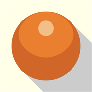
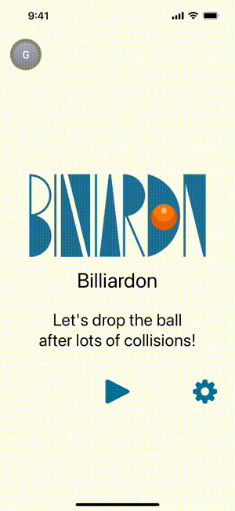

# Bllliardon

## App Information

<!-- en -->
  <b>More collide,but win! This is a new game where you compete for the count you collide the ball against the wall.</b> 
<ul>
  <li>Swipe the ball and collide the wall to reflect the ball, and the count of collision is the score.</li>
  <li>When the ball falls into the hole, you get the score.</li>
  <li>Let’s get a high score by devising swipe speeds and angles!</li>
  <li>If the ball stops without falling into the hole, no score will be awarded. Aim for the ball to land in the hole in the end!</li>
</ul>

<!-- ja -->
<b>当てるが勝ち！ ボールを壁に当てた回数を競う、新発想のゲームです。</b> 
<ul>
  <li>ボールをスワイプし壁に当てるとボールが反射し、ボールが壁に衝突した回数がスコアとなります。</li>
  <li>ボールが穴に落ちると、スコアを獲得できます。</li>
  <li>スワイプの速度や角度を工夫して、高スコアをゲットしましょう！</li>
  <li>ボールが穴に落ちないで停止した場合、スコアは獲得できません。最後に穴に落ちるように狙いましょう！</li>
</ul>

<h4>How to play / 遊び方</h4>
<!-- en -->
<ul>
    <li>After launching the application, tap the "▶︎" button to start the game. Swipe to throw the ball.</li>
  <li>The game ends when the ball falls into the hole or stops.</li>
  <li>After you throw the ball, you cannot control the ball while it is in motion.</li>
  <li>During the game, "Chance!" to re-throw the ball will occur at random. You can throw the ball again while keeping your score.</li>
  <li>When you launch the application, you can log in to GameCenter. Once logged in, you will be able to see the scores and rankings of the players.</li>
  <li>You can play without logging in to GameCenter, but the scores you get will not be saved.</li>
</ul>

<!-- ja -->
<ul>
  <li>アプリを起動した後、「▶︎」ボタンをタップするとゲーム開始です。スワイプしてボールを投げましょう。</li>
  <li>ボールが穴に落ちる、もしくは停止するとゲーム終了です。</li>
  <li>ボールを投げた後、ボールが動いている間はボールを操作できません。</li>
  <li>ゲーム中に、ボールを投げ直す「チャンス！」がランダムに発生。スコアを維持したままボールを再度投げることができます。</li>
  <li>アプリを起動すると、GameCenterへのログインが可能です。ログインすると、プレイヤー達のスコアと順位が確認できます。</li>
  <li>GameCenterにログインしなくてもプレイできますが、獲得したスコアは保存されません。</li>
</ul>

<h4>Purchase and select the playing ball / 有料ボール</h4>
<ul>
  <li>You can play with purchased balls.</li>
  <li>After launching the application, tap the settings button in the lower right corner of the screen to display the Item screen</li>
  <li>On the Item screen, you can purchase balls and specify which ball you use to play with.</li>
</ul>
<ul>
  <li>特殊な機能を持つボールを購入し、そのボールでプレイすることができます。</li>
  <li>アプリを起動した後、画面右下の設定ボタンをタップすると、アイテム画面が表示されます。</li>
  <li>アイテム画面では、ボール購入と、プレイするボールを指定できます。</li>
</ul>

<table><tr><td></td><td>Purple Ball / 紫ボール If the ball collides with a wall at right angles to the wall it just collided with, you get 2 points! For example, immediately after the ball collides with the right wall, if it collides with the upper or lower wall, you get 2 points, if it collides with the left wall, you get 1 point. 
直前に衝突した壁に対して直角方向の壁にボールが衝突すると、2点獲得できます！ 例えば、右側の壁にボールが衝突した直後、上もしくは下の壁に衝突したら2点獲得、左側の壁に衝突したら1点獲得です。</td></tr>
  <tr><td></td><td>Green Ball / 緑ボール After throwing the ball, you can stop and throw the ball again only once before it falls into the hole. When you throw the ball, a pause button appears, which you can tap only once. When you tap that button, the ball stops and you can throw again! In other words, if the ball is about to fall into a hole or you miss the throw, you can throw it again keeping your score. ボールを投げた後、穴に落ちる前までに、一度だけボールを停止して再度投げることができます！ ボールを投げると一時停止ボタンが表示され、一度だけタップできます。ボタンをタップするとボールが停止し、再度投げることができます。 つまり、ボールが穴に落ちそうになったり投げ損ねた時などに、スコアを維持したまま投げ直すことができるボールです。"</td></tr>
  </table>
  

## Download

[Contact Us] goazle.dev@gmail.com 
[Privacy Policy](PrivacyPolicy.md)
